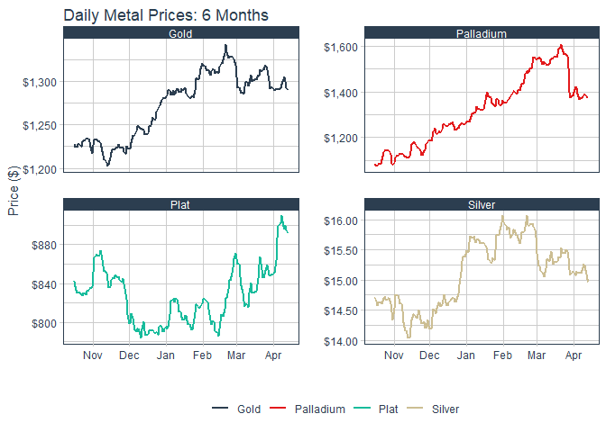
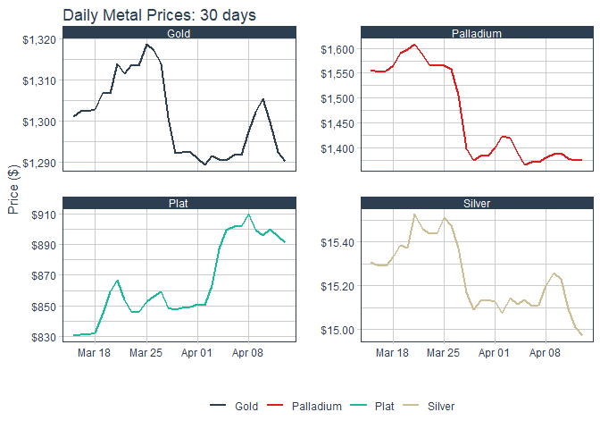
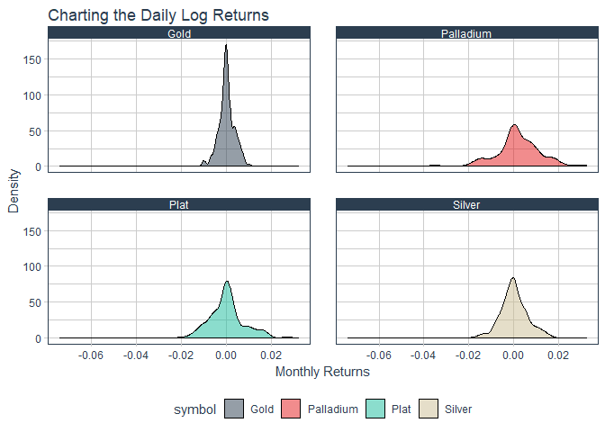

Gold, Platinum, Silver, Palladium pricing over several periods
================

Column
------

### 180 days

``` r
SixMonthsPrices%>%group_by(symbol)%>%
  ggplot(aes(x = date, y = price, color = symbol)) +
  geom_line(size = 1) +
  labs(title = "Daily Metal Prices: 6 Months",
       x = "", y = "Price ($)", color = "") +
  facet_wrap(~ symbol, ncol = 2, scales = "free_y") +
  scale_y_continuous(labels = scales::dollar) +
  theme_tq() + 
  scale_color_tq()
```



Column
------

### 30 days

``` r
OneMonthPrices%>%
 group_by(symbol)%>%
  ggplot(aes(x = date, y = price, color = symbol)) +
  geom_line(size = 1) +
  labs(title = "Daily Metal Prices: 30 days",
       x = "", y = "Price ($)", color = "") +
  facet_wrap(~ symbol, ncol = 2, scales = "free_y") +
  scale_y_continuous(labels = scales::dollar) +
  theme_tq() + 
  scale_color_tq()
```



### Daily Log Returns

``` r
log_returns %>%
  ggplot(aes(x = monthly.returns, fill = symbol)) +
  geom_density(alpha = 0.5) +
  labs(title = "Charting the Daily Log Returns",
       x = "Monthly Returns", y = "Density") +
  theme_tq() +
  scale_fill_tq() + 
  facet_wrap(~ symbol, ncol = 2)
```


